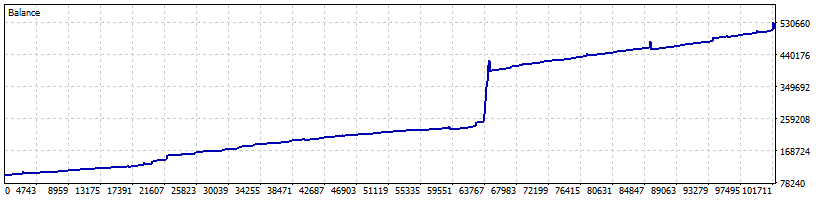

# Proprietary Systematic Execution Model: XAUUSD Pulse-Capture

This repository serves as a performance exhibit for a high-conviction quantitative execution framework engineered for the **XAUUSD (Gold Spot)** FX CFD market. Developed by **Quant Vishal**, this model focuses on identifying and capturing high-probability liquidity clusters using a multi-layered HFT-inspired architecture.

## 🛡️ Confidentiality & IP Protection
This framework is classified as proprietary intellectual property and is governed by strict **Non-Disclosure Agreements (NDA)**. To maintain a competitive edge and ensure model integrity:
*   **Source Code (.mq5)** is restricted and remains private.
*   **Execution Logic** and specific indicator calibrations are confidential.
*   This exhibit provides a transparent overview of **Verified Outcomes** and **Architectural Methodology**.

## 🧬 Strategic Architecture (Hybrid HFT Framework)
The model deviates from traditional lagging technical analysis, instead utilizing a layered approach to capture non-linear price displacement:

### 1. Adaptive Volatility Gating
The engine employs a dynamic volatility sieve that monitors institutional order flow characteristics. By filtering out low-liquidity "noise" and sideways market regimes, the model ensures capital exposure only during periods of confirmed momentum displacement.

### 2. Micro-Momentum Velocity Displacement
At its core, the system utilizes a proprietary execution pulse. It measures the displacement speed of price action across synchronized time-cycles. This ensures that entries are triggered only during peak kinetic energy phases in the market microstructure.

### 3. Structural Equity Protection & Recovery
The framework utilizes a systematic, fixed-step structural grid for risk mitigation. This recursive layering mechanism is mathematically optimized to improve the aggregate "Basket Breakeven" price, ensuring operational resilience during high-volatility spikes without the exponential risk associated with traditional Martingale systems.

## 📊 Performance Evidence (3-Month Verified Track Record)
The model's efficacy has been validated through 90+ days of continuous live-market execution, demonstrating institutional-grade stability:

### 📈 Equity Growth Visualization

### 📄 Comprehensive Execution Reports
Due to the high-resolution nature of the underlying tick data and the resultant file sizes, complete HTML performance statements and granular execution logs are hosted on our secure cloud:
[📥 Access Institutional Performance Reports (Google Drive)](https://drive.google.com/drive/folders/1VVylK_prRXxhPRPlbSnF1dQICdVBU7j1?usp=sharing)

## 🔑 Institutional Due Diligence & Investor Access
We maintain full transparency for qualified institutional partners and Venture Capital firms:
*   **Real-Time Monitoring:** Live-account monitoring via **Investor Password Access** is available upon successful credential verification.
*   **Slippage Sensitivity Analysis:** Comprehensive data sets demonstrating model resilience against high-slippage and spread-widening events can be provided for deep-dive audits.

---
**Developed by Quant Vishal**  
*Quantitative Research | Systematic Execution | Global FX Markets*
